<!--
  GitHub 个人主页 README
  自动展示于 https://github.com/daitcl
-->

<h1 align="center">👋 你好，我是 dait</h1>

  

  
  
  
  

---

## 👋 关于我

你好！我是 **dait**，一名热爱编程与分享的开发者。  
这里是我的**技术小栈**，记录着我一路的学习脚印与实践心得——无论是深入源码的笔记、项目落地的复盘，还是偶尔发现的“奇技淫巧”，我都会认真整理并分享出来。

我相信 **输出是最好的输入**，也希望通过开放的文字，与同行的你交流碰撞，一起成长。

---

## 📝 为什么写博客？

- **记录**：把模糊的“我知道”变成清晰的“我能写出来”
- **复盘**：每完成一个项目或解决一个难题，沉淀为可复用的经验
- **分享**：也许我踩过的坑，能帮你省下一些时间
- **连接**：通过文字认识更多有趣的朋友和同行

---

## 🔗 来找我

- **CSDN**：[daitcl的博客](https://blog.csdn.net/qq_39538318) — 技术文章首发地
- **GitHub**：[@daitcl](https://github.com/daitcl) — 开源项目与代码片段（你正在这里）
- **微信公众号**：扫一扫下方二维码，获取更新推送  
    
- **邮箱**：daitcctop@163.com — 欢迎交流、指正或闲聊

---

## ☕ 支持与鼓励

如果你觉得某篇文章对你有帮助，或者单纯想请我喝杯咖啡，可以前往 **爱发电** 赞助支持。每一份鼓励都会让我更有动力继续创作。

  

---

## 📢 创作者认证声明

本人已入驻 **爱发电** 平台，并依据平台“创作者认证”流程要求，在此公开宣传我的爱发电主页：

👉 **https://ifdian.net/a/daitcc**

同时，我在以下最常使用的平台中也已公开本主页（用于交叉验证）：
- **CSDN**：[博客主页](https://blog.csdn.net/qq_39538318) — 个人签名/置顶文章包含爱发电链接
- **GitHub**：[daitcl](https://github.com/daitcl) — 本 README 中已包含爱发电链接
- **微信公众号**：菜单栏已配置“爱发电”入口

---

## 📊 GitHub 统计

  
  

  

---

> “独行快，众行远。” 感谢你的每一次阅读、点赞和分享。  
> 期待在技术道路上，与你并肩前行。
