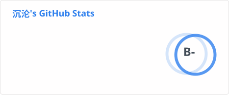
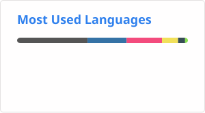

<!--
  GitHub 个人主页 README · 简洁留白风
  自动展示于 https://github.com/daitcl
-->

<h3 align="center">
  <samp>你好，我是 dait 👋</samp>
</h3>

  <samp>热爱编程 · 乐于分享 · 相信「输出是最好的输入」</samp>

  
  
  
  
  

 

---

<h3><samp>　关于我</samp></h3>

你好！我是 **dait**，一名热爱编程与分享的开发者。

这里是我的 **技术小栈**，记录着一路走来的学习脚印与实践心得——无论是深入源码的笔记、项目落地的复盘，还是偶尔发现的「奇技淫巧」，我都会认真整理并分享出来。

 

---

<h3><samp>　项目展示</samp></h3>

| 项目 | 语言 | 简介 |
| :-- | :-- | :-- |
| **[mihomo](https://github.com/daitcl/mihomo)**  |  | 基于 Clash 核心的代理工具镜像，集成 Metacubexd 管理面板，开箱即用的 Web 管理界面。 |
| **[ablesciSign](https://github.com/daitcl/ablesciSign)**  |  | 科研通自动签到脚本，支持青龙面板与 GitHub Actions 双平台运行，多账号 + 多渠道通知。 |
| **[Qt-demo](https://github.com/daitcl/Qt-demo)**  |  | 个人 Qt 工程合集，含线程安全串口通信管理库等示例，配套系列教程。 |

 

---

<h3><samp>　文章推荐</samp></h3>

- [Qt6基础教程：多线程串口通信实战](https://daitcc.top/posts/13725773/)
  将串口操作封装进工作线程，通过 SerialManager 对外提供简洁接口，实现串口通信与界面逻辑完全分离。
- [使用 Github Action 定时签到科研通](https://daitcc.top/posts/4f391d11/)
  用 GitHub Actions 实现科研通每日自动签到，支持多账号与多渠道推送通知。

 

---

<h3><samp>　为什么写博客</samp></h3>

| | |
| :-- | :-- |
| **记录** | 把模糊的「我知道」变成清晰的「我能写出来」 |
| **复盘** | 每完成一个项目或解决一个难题，沉淀为可复用的经验 |
| **分享** | 也许我踩过的坑，能帮你省下一些时间 |
| **连接** | 通过文字认识更多有趣的朋友和同行 |

 

---

<h3><samp>　来找我</samp></h3>

  <a href="https://blog.csdn.net/qq_39538318">CSDN</a> ·
  <a href="https://github.com/daitcl">GitHub</a> ·
  <a href="https://www.daitcc.top">个人网站</a> ·
  <a href="https://ifdian.net/a/daitcc">爱发电</a> ·
  <a href="mailto:daitcctop@163.com">邮箱</a>

<samp>　微信公众号</samp>

 

 

---

<h3><samp>　GitHub 统计</samp></h3>

  
  

  

  <picture>
    <source media="(prefers-color-scheme: dark)" srcset="./profile/snake-dark.svg" />
    
  </picture>

  

 

---

<samp>　创作者认证声明</samp>

 

本人已入驻 **爱发电** 平台，并依据平台「创作者认证」流程要求，在此公开宣传我的爱发电主页：

👉 **https://ifdian.net/a/daitcc**

同时，我在以下最常使用的平台中也已公开本主页（用于交叉验证）：
- **个人网站**：[daitcc.top](https://www.daitcc.top) — 个人签名/置顶文章包含爱发电链接
- **GitHub**：[daitcl](https://github.com/daitcl) — 本 README 中已包含爱发电链接
- **微信公众号**：菜单栏已配置「爱发电」入口

 

  <samp>「独行快，众行远。」 感谢你的每一次阅读、点赞和分享。</samp>

